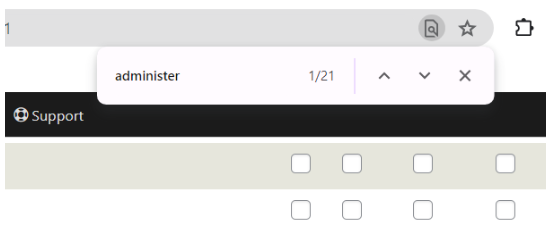
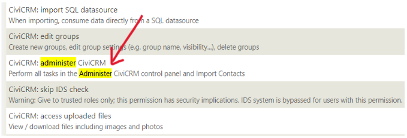
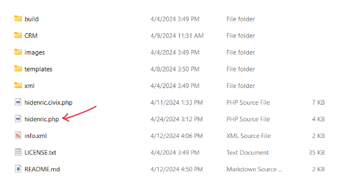
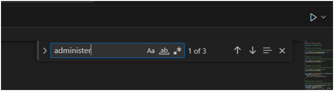
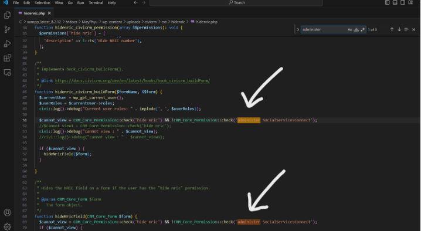
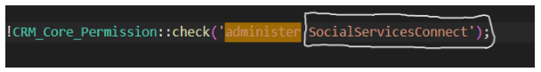
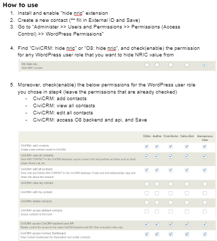

# HideNRIC

This extension includes a custom permission named "hidenric" which will hide NRIC record in contact summary page and prevent editing NRIC field from the user. We can choose desired WordPress user roles to do so. 

## Getting Started

1. “Administer >> Users and Permissions >> Permissions (Access Control) >> WordPress Permissions”

2. Press “Ctrl” and “F” on the keyboard simultaneously and search the word “administer”

3. Observe the word after “administer” whether it is “administer O8” or “administer CiviCRM” or “administer SocialServicesConnect” or “administer ……”

4. Take note of the word after “administer”
5. Extract the zip file of the extension and Open the extracted files and open “hidenric.php” in Visual Studio

6. Press “Ctrl” and “F” on the keyboard simultaneously and 
Type “administer” in search field 

7. “administer” will be highlighted in 3 places

8. Change the word after “administer” accordingly to the word you noted in step4 in all 3 places

For me, I need to change from ‘SocialServicesConnect’ to ‘CiviCRM’.
Change the word according to your site

9. Save "hidenric.php"

## Don'ts
DO NOT GIVE the below permissions with administer privileges to the WordPress user role who you want to hide NRIC from.
O8: administer O8 (***important to not check since some condition are made with this permission in the code)  
O8: administer O8 system
O8: administer O8 data
O8: all O8 permissions and ACLs
Any permissions which will make the role to become an Administrator

(* FIXME *)

This is an [extension for CiviCRM](https://docs.civicrm.org/sysadmin/en/latest/customize/extensions/), licensed under [AGPL-3.0](LICENSE.txt).